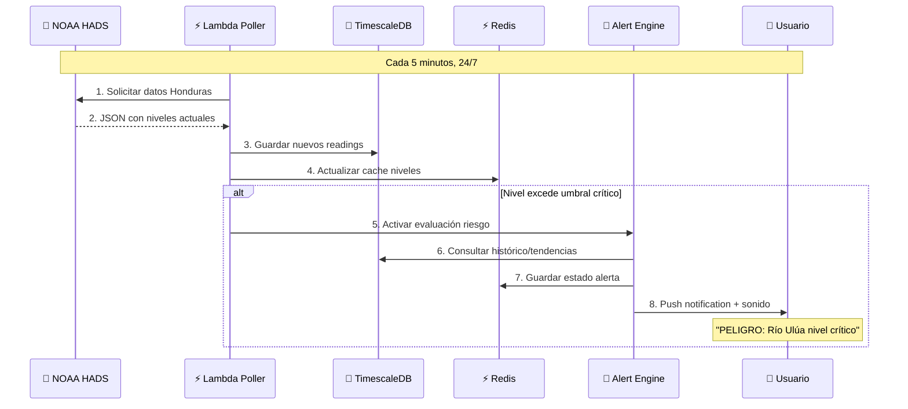
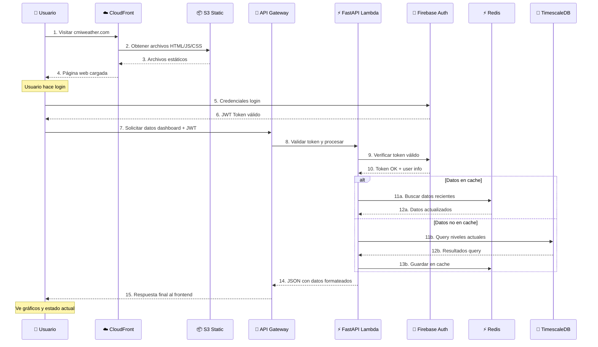

# Arquitectura General CMIPRO
## Sistema de Monitoreo Hidrológico - Explicación Detallada

### 🎯 ¿Qué Estamos Construyendo?

CMIPRO es un **sistema de alertas de emergencia** que monitora los niveles de ríos en Honduras y notifica a los usuarios cuando hay riesgo de inundación. La arquitectura debe garantizar:

1. **Disponibilidad 24/7**: Las alertas de emergencia no pueden fallar
2. **Respuesta rápida**: Detectar crecidas en menos de 5 minutos
3. **Escalabilidad**: Manejar desde 100 hasta 10,000 usuarios
4. **Seguridad**: Proteger datos de usuarios y sistema
5. **Costo-efectivo**: Optimizado para presupuesto de startup

### 🏗️ Arquitectura por Capas (De Afuera Hacia Adentro)

```
🌐 INTERNET (Usuarios del Valle de Sula)
    ↓
🛡️ CAPA DE SEGURIDAD (CloudFront + WAF)
    ↓
📱 CAPA DE PRESENTACIÓN (Frontend Next.js)
    ↓
⚡ CAPA DE APLICACIÓN (API Gateway + Lambda)
    ↓
💾 CAPA DE DATOS (TimescaleDB + Redis + S3)
    ↓
🌊 SERVICIOS EXTERNOS (NOAA, Firebase, Stripe)
```

### 📋 Componentes del Sistema Explicados

#### 1. **CloudFront CDN** (Puerta de Entrada)
```yaml
Qué es: Red de distribución de contenido global de AWS
Función: 
  - Acelerar carga del sitio web en Honduras
  - Proteger contra ataques DDoS
  - Cachear contenido estático (imágenes, CSS, JS)
  - Dirigir tráfico API al backend

Por qué lo necesitamos:
  - Honduras tiene conexión limitada a internet
  - Mejora velocidad de carga 3-5x
  - Protección automática contra ataques
  - Reduce costos de transferencia de datos
```

#### 2. **AWS WAF** (Firewall Web)
```yaml
Qué es: Firewall de aplicaciones web
Función:
  - Bloquear ataques maliciosos (SQL injection, XSS)
  - Limitar requests por IP (rate limiting)
  - Filtrar tráfico por geolocalización
  - Bloquear IPs sospechosas automáticamente

Por qué lo necesitamos:
  - Proteger contra OWASP Top 10 vulnerabilidades
  - Prevenir abuso del sistema de alertas
  - Cumplir con estándares de seguridad
  - Reducir carga en servidores backend
```

#### 3. **S3 + Hosting Estático** (Frontend)
```yaml
Qué es: Almacenamiento de archivos + hosting web estático
Función:
  - Servir archivos HTML, CSS, JS del frontend
  - Almacenar imágenes y assets
  - Versionado automático de deploys
  - Integración con CloudFront

Por qué esta arquitectura:
  - Next.js genera archivos estáticos optimizados
  - No necesitamos servidor siempre corriendo
  - Escalabilidad automática sin configuración
  - Costo muy bajo (centavos por mes)
```

#### 4. **API Gateway** (Puerta de Entrada al Backend)
```yaml
Qué es: Servicio que gestiona todas las llamadas API
Función:
  - Recibir requests HTTP de frontend
  - Routear a diferentes Lambda functions
  - Manejar autenticación con Firebase
  - Aplicar rate limiting por usuario
  - Transformar requests/responses

Por qué lo necesitamos:
  - Punto único de entrada para APIs
  - Escalabilidad automática
  - Logging y monitoreo integrado
  - Gestión de versiones de API
```

#### 5. **Lambda Functions** (Lógica de Negocio)
```yaml
Qué son: Funciones serverless que ejecutan código
Funciones principales:
  
  CMIPRO-API (FastAPI):
    - Procesar requests de frontend
    - Consultar base de datos TimescaleDB
    - Validar permisos de usuario
    - Formatear respuestas JSON
  
  NOAA-Poller:
    - Ejecutarse cada 5 minutos automáticamente
    - Descargar datos desde NOAA HADS
    - Parsear y validar información
    - Almacenar en TimescaleDB
    - Evaluar umbrales de riesgo
    - Activar alertas si es necesario
  
  Stripe-Webhook:
    - Recibir notificaciones de pagos
    - Actualizar estado de suscripciones
    - Activar/desactivar acceso premium
  
  Alert-Engine:
    - Evaluar niveles contra umbrales (del martes)
    - Calcular población en riesgo
    - Enviar notificaciones push
    - Registrar eventos de alerta

Por qué serverless:
  - Pago solo por uso (no server 24/7)
  - Escalabilidad automática
  - Alta disponibilidad built-in
  - Mantenimiento mínimo
```

#### 6. **TimescaleDB** (Base de Datos Principal)
```yaml
Qué es: PostgreSQL optimizado para series temporales
Función:
  - Almacenar readings de niveles de río cada 5 minutos
  - Mantener histórico de alertas
  - Gestionar usuarios y suscripciones
  - Ejecutar queries complejas de tendencias
  - Compresión automática de datos antiguos

Por qué TimescaleDB vs PostgreSQL normal:
  - Optimizado para datos con timestamps
  - Queries 100x más rápidas en datos temporales
  - Compresión automática (reduce costos)
  - Particionamiento inteligente por fecha
  - Compatible con todas las herramientas PostgreSQL
```

#### 7. **Redis Cache** (Memoria Rápida)
```yaml
Qué es: Base de datos en memoria ultra-rápida
Función:
  - Cache de datos frecuentes (niveles actuales)
  - Sesiones de usuario
  - Rate limiting contadores
  - States temporales de alertas
  - Cache de respuestas API pesadas

Por qué necesario:
  - TimescaleDB consultas pueden tomar 1-2 segundos
  - Redis responde en <10ms
  - Reduce carga en base de datos principal
  - Mejora experiencia de usuario significativamente
```

#### 8. **S3 Buckets** (Almacenamiento de Archivos)
```yaml
Buckets especializados:

cmipro-frontend-prod:
  - Archivos estáticos del sitio web
  - Imágenes optimizadas
  - Assets compilados de Next.js

cmipro-assets:
  - Imágenes de noticias
  - Iconos personalizados
  - Documentos PDF

cmipro-backups:
  - Backups diarios de TimescaleDB
  - Exports de configuración
  - Snapshots de código

cmipro-logs:
  - Logs de aplicación estructurados
  - Eventos de seguridad
  - Métricas personalizadas
```

### 🔄 Flujos de Datos Críticos

#### Flujo 1: Monitoreo en Tiempo Real


**¿Por qué este flujo?**
- **Automatización total**: Sin intervención humana 24/7
- **Redundancia**: Si un paso falla, no detiene el monitoreo
- **Velocidad**: Detección de crecidas en <5 minutos
- **Confiabilidad**: Múltiples validaciones antes de alertar

#### Flujo 2: Usuario Accede al Dashboard


**¿Por qué este flujo?**
- **Performance**: CDN sirve archivos en <500ms
- **Seguridad**: Validación de tokens en cada request
- **Eficiencia**: Cache evita queries innecesarias a DB
- **Escalabilidad**: Cada componente escala independiente

### 🔧 Decisiones Arquitectónicas Clave

#### ¿Por qué Serverless vs Servidores Tradicionales?

**Servidores Tradicionales** (EC2, VPS):
```
❌ Costo fijo 24/7 (~$50-100/mes)
❌ Requiere mantenimiento constante
❌ Escalado manual complicado
❌ Punto único de falla
❌ Gestión de OS y seguridad
```

**Serverless** (Lambda + Managed Services):
```
✅ Pago por uso real ($0-15/mes inicial)
✅ Cero mantenimiento de servidores
✅ Escalado automático instantáneo
✅ Alta disponibilidad built-in
✅ AWS maneja toda la seguridad base
```

#### ¿Por qué TimescaleDB vs Otras Bases de Datos?

**MongoDB** (NoSQL):
```
❌ No optimizada para series temporales
❌ Queries complejas más difíciles
❌ Menos herramientas de análisis
```

**MySQL** (Relacional tradicional):
```
❌ Performance pobre con millones de readings
❌ Sin compresión automática
❌ Particionamiento manual complejo
```

**TimescaleDB** (PostgreSQL + Time Series):
```
✅ 100x más rápida para datos temporales
✅ Compresión automática (reduce 90% storage)
✅ Compatible con todas las herramientas PostgreSQL
✅ Funciones especiales para análisis temporal
✅ Particionamiento automático por fecha
```

### 📊 Especificaciones de Performance

#### Objetivos Medibles
| Métrica | Objetivo | ¿Cómo se mide? |
|---------|----------|----------------|
| **Tiempo respuesta API** | <2 segundos | CloudWatch métricas |
| **Detección crecidas** | <5 minutos | Custom métrica NOAA polling |
| **Disponibilidad sistema** | 99.5% uptime | StatusPage + health checks |
| **Carga usuarios concurrentes** | 1,000 simultáneos | Load testing con k6 |
| **Tiempo alerta crítica** | <30 segundos | End-to-end testing |

#### Capacidades por Componente
| Componente | Capacidad Inicial | Límite Máximo | Escalado |
|------------|-------------------|---------------|----------|
| **Lambda Concurrency** | 100 ejecuciones | 1,000 ejecuciones | Automático |
| **API Gateway** | 1,000 RPS | 10,000 RPS | Automático |
| **TimescaleDB** | 100 conexiones | 1,000 conexiones | Manual |
| **Redis** | 512MB memoria | 25GB memoria | Manual |
| **S3 Requests** | 3,500 GET/s | Sin límite | Automático |

### 💰 Estrategia de Costos

#### Costo por Fase de Crecimiento

**Fase 1: MVP (0-100 usuarios)**
```
AWS Free Tier: $0/mes
- Lambda: 1M requests gratis
- API Gateway: 1M requests gratis  
- RDS: 750 horas gratis
- S3: 5GB gratis
- CloudFront: 50GB transfer gratis

Servicios externos: $10/mes
- OpenAI API: $5/mes
- Dominio: $0.56/mes
- Firebase Auth: $0 (hasta 10K users)

Total: ~$10/mes
```

**Fase 2: Crecimiento (100-1000 usuarios)**
```
AWS Post-Free Tier: $58/mes
- RDS db.t3.small: $25/mes
- Lambda executions: $5/mes
- API Gateway: $3/mes
- S3 + CloudFront: $5/mes
- ElastiCache Redis: $15/mes
- WAF: $5/mes

Servicios externos: $15/mes
Total: ~$73/mes
```

**Fase 3: Escala (1000+ usuarios)**
```
AWS Scaled: $200-400/mes
- RDS Multi-AZ: $60/mes
- Lambda + provisioned concurrency: $50/mes
- API Gateway: $25/mes
- Enhanced monitoring: $20/mes
- Larger Redis: $45/mes

Total: ~$300/mes
```

### 🔒 Consideraciones de Seguridad

#### Principio de Defensa en Profundidad
1. **Edge Security**: WAF + DDoS protection
2. **Network Security**: VPC + Security Groups
3. **Application Security**: Input validation + rate limiting  
4. **Data Security**: Encryption at rest + in transit
5. **Identity Security**: Firebase Auth + JWT validation
6. **Monitoring Security**: Automated threat detection

#### Cumplimiento y Regulaciones
- **GDPR**: User data deletion capabilities
- **SOC 2**: AWS compliance inheritance  
- **Honduras Data Protection**: Local compliance
- **PCI DSS**: Stripe handles all payment data

### 🔄 Integración con Trabajo de la Semana 1

#### Lunes: Endpoints REST → API Gateway Routes
```python
# Endpoints del lunes se convierten en:
@app.get("/api/v1/stations")           # → Lambda function
@app.get("/api/v1/levels")             # → Lambda function  
@app.get("/api/v1/alerts")             # → Lambda function
@app.post("/api/v1/alerts/acknowledge") # → Lambda function
```

#### Martes: Umbrales de Riesgo → Alert Engine Logic
```python
# Umbrales del martes se implementan en:
def evaluate_risk_level(station_id: str, current_level: float):
    thresholds = get_station_thresholds(station_id)
    # Lógica de 6 niveles: normal, low, moderate, high, very-high, critical
    population_at_risk = calculate_population_impact(station_id, risk_level)
```

#### Miércoles: Wireframes → Frontend Structure
```typescript
// Wireframes HTML se convierten en componentes Next.js:
pages/
├── dashboard/           # Dashboard wireframe
├── alerts/             # Alertas wireframe  
├── stations/[id]/      # Detalle estación
└── auth/              # Login/registro wireframes
```

#### Jueves: Figma Design → CSS Variables + Components
```css
/* Design tokens del jueves se integran en: */
:root {
  --risk-critical: #FF0000;    /* Del sistema de colores */
  --font-primary: 'Inter';     /* De especificaciones tipográficas */
  --spacing-lg: 16px;          /* Del sistema de espaciado */
}
```

### 🎯 Plan de Implementación (Próximas Semanas)

#### Semana 2-3: Infrastructure + Backend
1. **Terraform setup**: Provisionar toda la infraestructura AWS
2. **TimescaleDB**: Crear schemas y funciones del martes
3. **Lambda NOAA Poller**: Implementar función de monitoreo
4. **FastAPI core**: Desarrollar endpoints del lunes
5. **Firebase integration**: Conectar autenticación

#### Semana 4-5: Frontend + Integration  
1. **Next.js setup**: Implementar componentes del jueves
2. **Dashboard**: Conectar gráficos con APIs
3. **Alert system**: Notificaciones push browser
4. **Stripe integration**: Pagos y suscripciones
5. **End-to-end testing**: Validar flujos completos

### ✅ Criterios de Éxito de la Arquitectura

#### Validaciones Técnicas
- [ ] Maneja 1,000 usuarios concurrentes sin degradación
- [ ] Detecta crecidas de río en <5 minutos  
- [ ] API response time <2 segundos en percentil 95
- [ ] Sistema recupera de fallos en <10 minutos
- [ ] Costos permanecen <$100/mes hasta 1,000 usuarios

#### Validaciones de Negocio
- [ ] Usuarios pueden suscribirse y pagar fácilmente
- [ ] Alertas llegan confiablemente a usuarios
- [ ] Sistema funciona 24/7 sin intervención manual
- [ ] Facilita growth de 100 → 10,000 usuarios
- [ ] Cumple regulaciones locales de Honduras

Esta arquitectura proporciona la base sólida para construir CMIPRO como un sistema confiable que puede salvar vidas en el Valle de Sula, combinando tecnología moderna con diseño centrado en el usuario y optimización de costos.